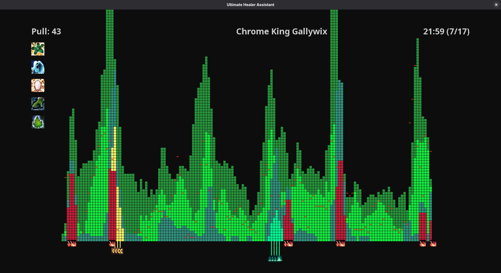
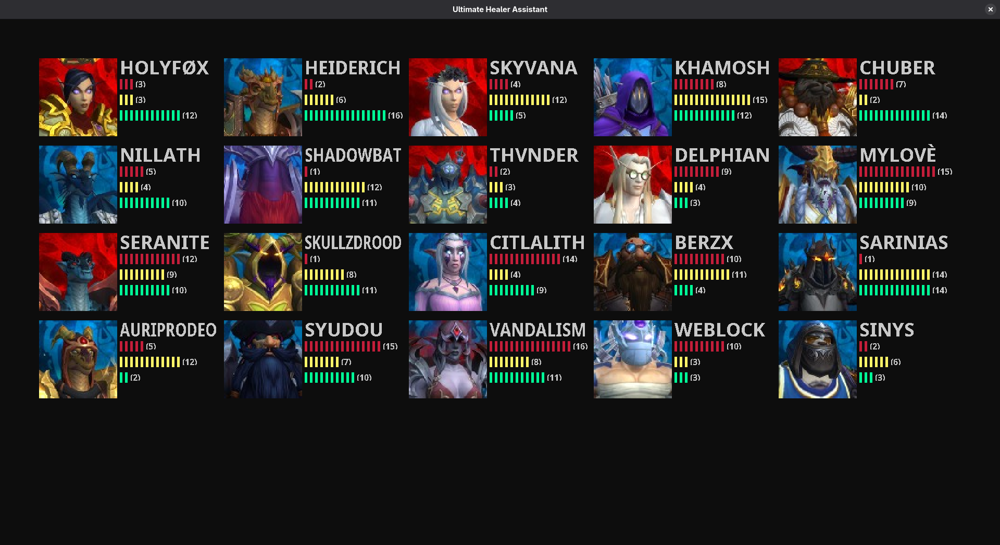

# Ultimate Healer Assistant

A utility program intended to help analyze World of Warcraft raid healing, assist in the construction of healing assignments, and evaluate individual performance.

## Functionality

### Healing Graphs

Nicely summarize the healing profile of pulls into an easy-to-read graph, including the impact players and CDs had on the healing profile.

Plans to support all 7 healing classes as well as their major CDs.

### Night Performance Summaries

Categorize and nicely summarize the night's mistakes in a single panel.

